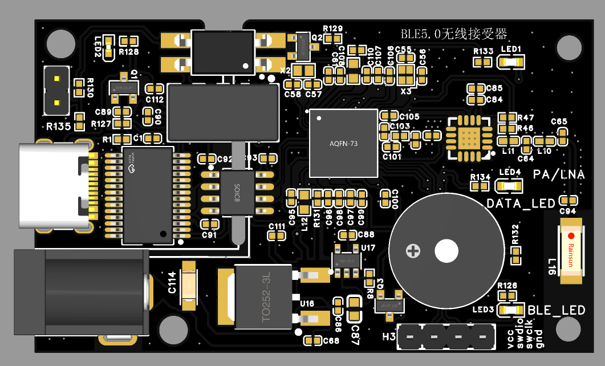

# FEM-
测试nRF21540的性能实验
***
>* 更新2023-08-10

1.补充文件夹说明
|文件夹名称| 内容   |
|  :---:   | :-----:  | 
| 21540官网硬件下载资料     | 官网下载的资料，21540-DK开发板AD图 |
| MATLAB代码                | 心电从机的测试代码 |
| picture                   | 主从机2D图 |
| PPT与手册                 | 视频PPT与21540手册 |
| 测试视频                   | 视频中测试视频，附带青风开发板测试 |

***
>* 更新2023-08-06

- ppi关联LNA/PA调试代码<br>

```c
static void pa_lna_assist(uint32_t gpio_pa_pin, uint32_t gpio_lna_pin)<br>
{<br>

    ret_code_t err_code;<br>
    nrf_gpio_cfg_output(gpio_pa_pin);<br>
    nrf_gpio_pin_clear(gpio_pa_pin); <br>
    nrf_gpio_cfg_output(gpio_lna_pin);<br>
    nrf_gpio_pin_clear(gpio_lna_pin); <br>
	
    static const uint32_t gpio_toggle_ch = 0;
    static const uint32_t ppi_set_ch = 13;
    static const uint32_t ppi_clr_ch = 14;

    // Configure SoftDevice PA/LNA assist
    static ble_opt_t opt;
    memset(&opt, 0, sizeof(ble_opt_t));
	
    // Common PA/LNA config
    opt.common_opt.pa_lna.gpiote_ch_id  = gpio_toggle_ch;        // GPIOTE channel
    opt.common_opt.pa_lna.ppi_ch_id_clr = ppi_clr_ch;            // PPI channel for pin clearing
    opt.common_opt.pa_lna.ppi_ch_id_set = ppi_set_ch;            // PPI channel for pin setting
	
    // PA config
    opt.common_opt.pa_lna.pa_cfg.active_high = 1;                // Set the pin to be active high
    opt.common_opt.pa_lna.pa_cfg.enable      = 1;                // Enable toggling
    opt.common_opt.pa_lna.pa_cfg.gpio_pin    = gpio_pa_pin;      // The GPIO pin to toggle

    // LNA config
    opt.common_opt.pa_lna.lna_cfg.active_high  = 1;              // Set the pin to be active high
    opt.common_opt.pa_lna.lna_cfg.enable       = 1;              // Enable toggling
    opt.common_opt.pa_lna.lna_cfg.gpio_pin     = gpio_lna_pin;   // The GPIO pin to toggle

    err_code = sd_ble_opt_set(BLE_COMMON_OPT_PA_LNA, &opt);
    APP_ERROR_CHECK(err_code);
}
```

1. ppi的关联可以自己选择<br>
2. 注意在协议栈初始化之后调用
3. 另外使能后会占用GPIOTE0的回调事件，请空出第一个GPIOTE的回调事件即可。

[]

